# Issues that you might encounter while creating Delta Live Tables (DLT) in Azure Databricks.
### 1. Delta Live Tables tab may not be visible under Workflows tab.
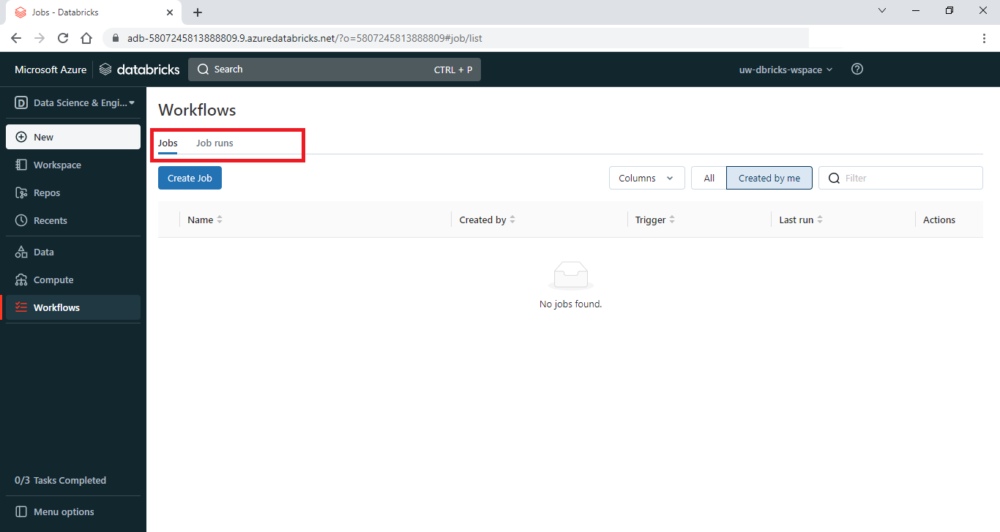
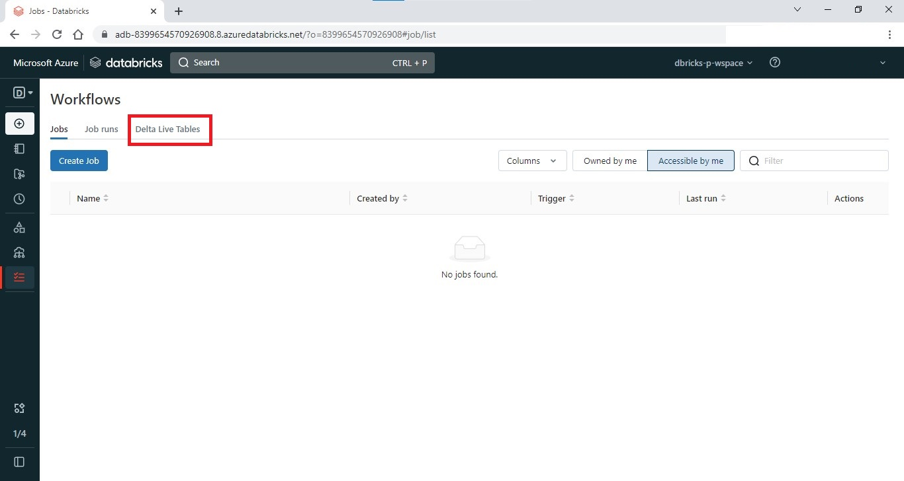
DLT is available only in Premium Pricing Tier, it is not available in Standard Pricing Tier
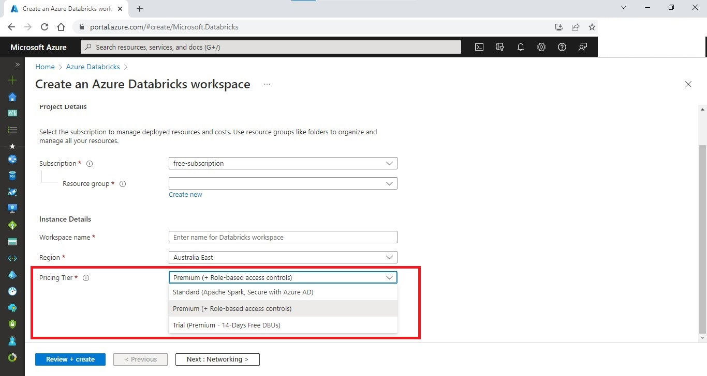

### 2. Azure Quota Exhaustion Issue
After clicking _Create_ in _Create Pipeline_ page, Waiting for resources step might throw an Azure error.
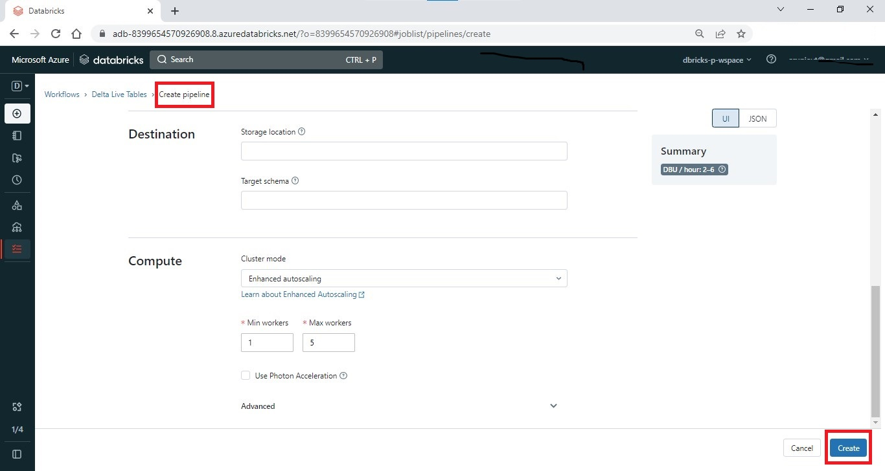
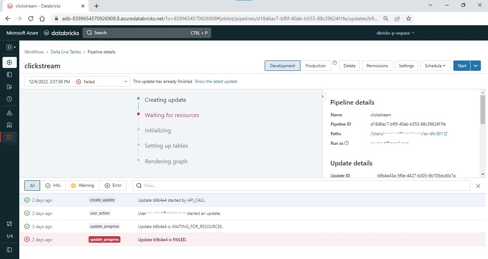
In the _Logs_ tab, click on the line which is highlighted in red.
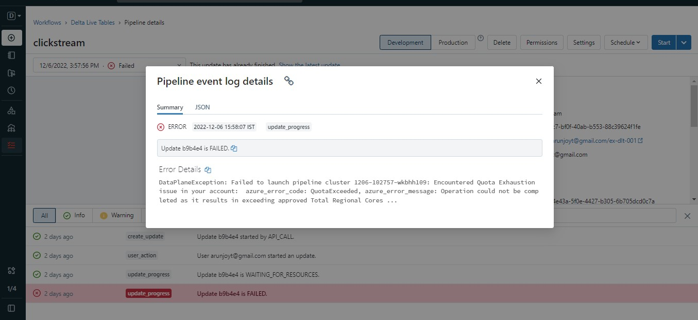
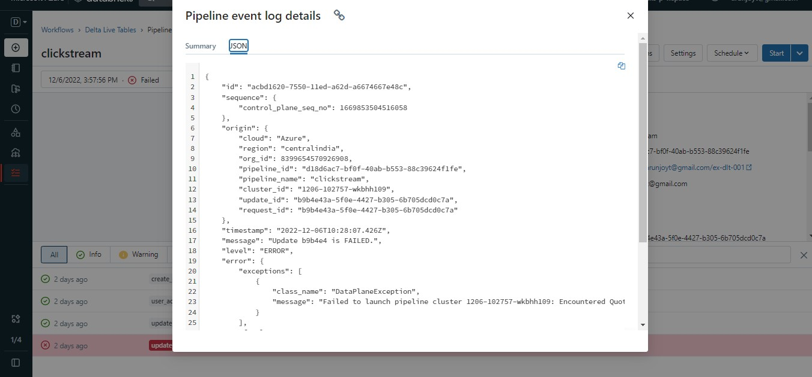
There is a panel on the right, scroll down till you reach the end. Click on _Logs_ button.
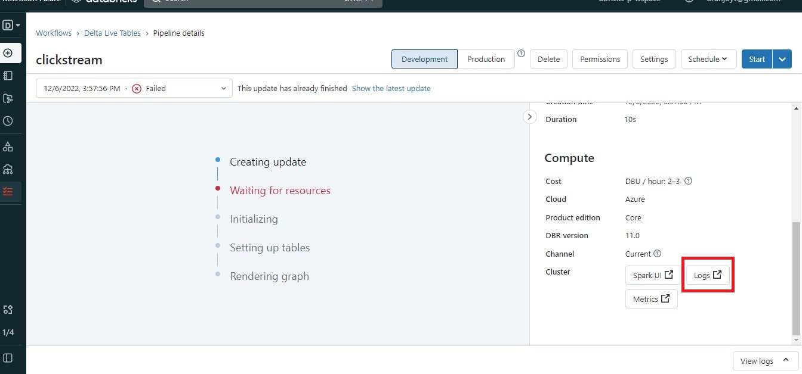
Hover on the red exclamation mark, you will get an explanation of the error. There is a link in the explanation, copy the link and paste into a new browser tab where your Azure portal is open.
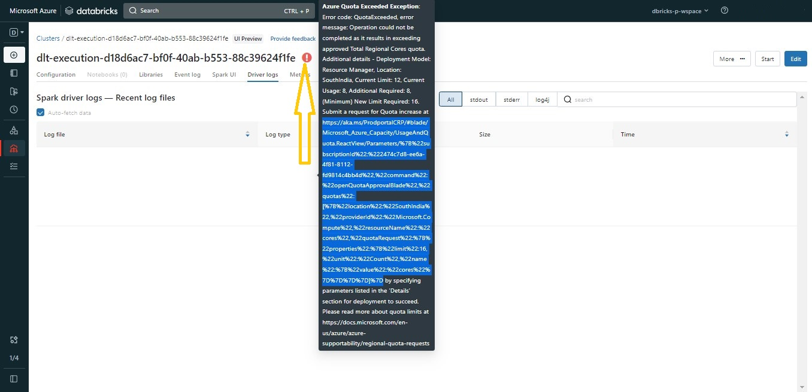
If you are finding it difficult to copy the link in the above step, go to _Event Log_ page.
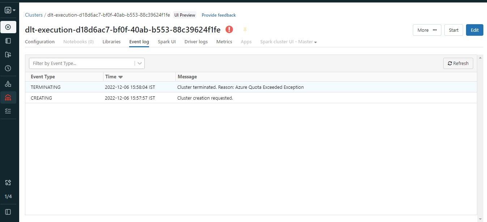
Click the first line ‘TERMINATING’. The link can be copied from here as well.
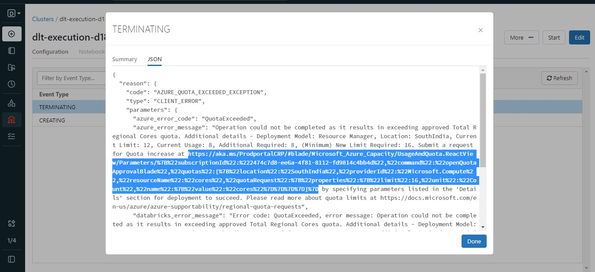
Copy the link and paste the link into the same browser where your Azure portal is open. Azure’s “Request quota increase” page will open up. Do as suggested there.
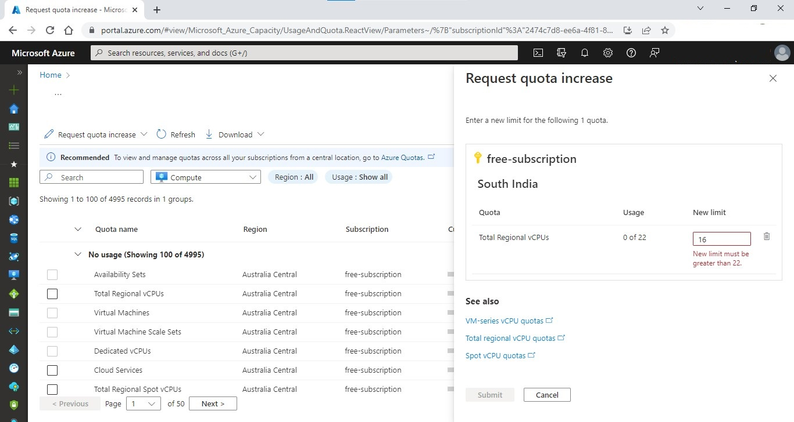
You might encounter similar Azure errors again for different Azure resources. Follow the same method as the previous one.

### 3. Databricks feature not supported error.
Some features like _Data quality check_ is available only in **Advanced** edition of Data Live Tables. This will throw an error.
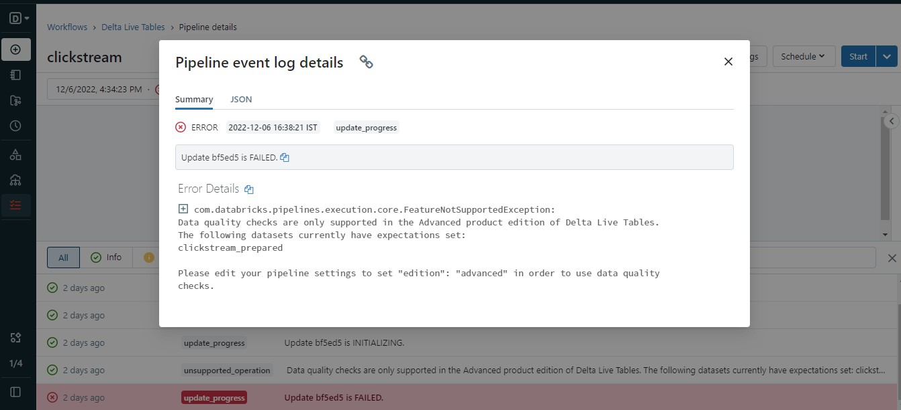
So change the edition accordingly from the Pipeline setting page.
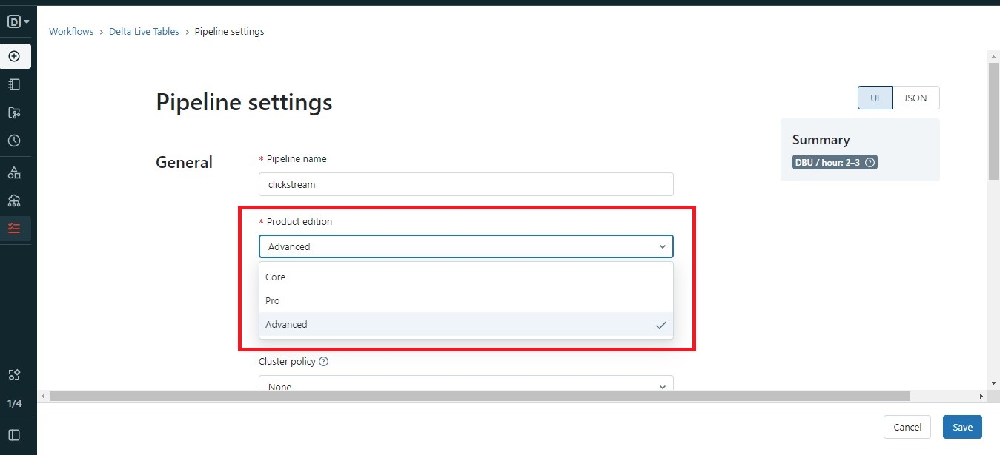